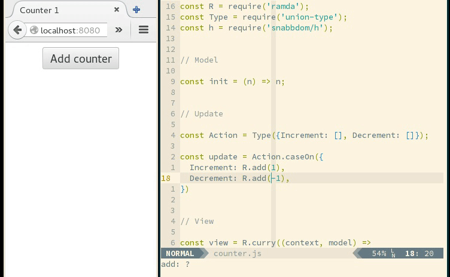

# Counters example with hot component reloading

This example implements a counters example with hot reloading of components
using webpack. This means that you can modify components/modules and the
changes will be loaded into your browser without a page refresh.

This example implemented with Snabbdom, union-type and Ramda. It
is similair to the [counters example](../counters-no-frp) expect the pure
recursive asynchronous main function has been replaced with an imperative
variant to facilitate the how swapping.

The code responsible for the hot swapping is in [main.js](./main.js). The
implementation is simple, even trivial since components in the architecture
consists of pure function only and does not carry private state.

# Demonstration

In the recording I first create a few counters, then I increment them, after
which I edit the increment and decrement amount, afterwards the counters
immediately change with the new amount. After that I modify the color of the
numbers and the initial count of counters. All changes are applied immediately
without a browser reload.



# How run it

Install the dependencies.

```javascript
npm install
```

You must have the webpack dev server installed

```javascript
npm install -g webpack-dev-server
```

Then start it

```js
webpack-dev-server --hot --inline
```

Then open: [http://localhost:8080/](http://localhost:8080/)

You can now make changes to [counters.js](./counters.js) and
[counter.js](./counter.js). Any changes will be hot swapped into any browsers
with the page open.
